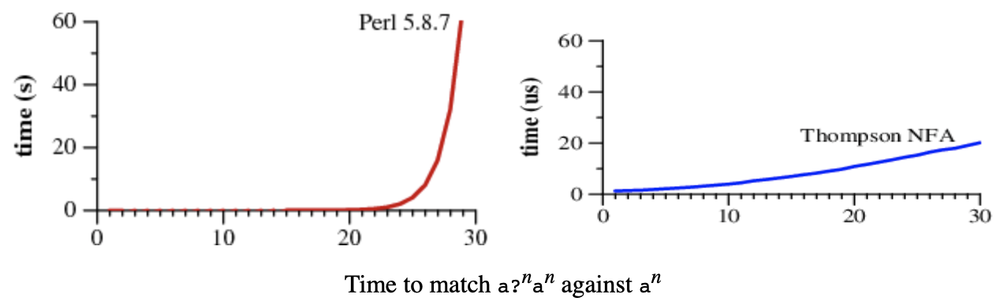
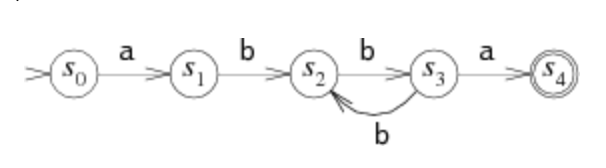
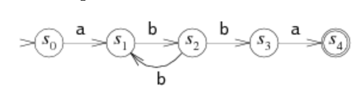

# Regular Expression Matching Can Be Simple And Fast
## (but is slow in Java, Perl, PHP, Python, Ruby, ...)

By Russ Cox

rsc@swtch.com

January 2007

## Concepts and Definitions

**Regular expressions (regex):** a notation for describing sets of character strings. If a string is in the set described by the regex, the regex matches the string.

**Backreferences:** a regex extension matches a string matched by a previous parenthesized expression. An example (cat|dog)\1 matches "catcat" and "dogdog". This additional extension comes at a significant algorithmic cost.

**Finite Automata:** state machines that describe a language.

**Deterministic Finite Automaton (DFA):** A finite automaton, where for each possible input character, there is at most one active state.

**Nondterministic Finite Automaton (NFA):** A finite automaton, where there may be multiple active states for a given input.

## Introduction

This article explores two approaches to regular expression matching and their performance tradeoffs; the author concisely demonstrates the significant performance disparity between the two in the plot below. 

<figure>
    
        <figcaption>Perl regex engine vs. Thompson NFA performance.</figcaption>
</figure>

Both plots show the time required to match the regular expression a?nan against the input string an. Notice that the y axes are different (seconds vs micro-seconds), showing Thompson's NFA engine to be millions of times faster!

## Finite Automata

Finite Automata are state machines that also describe sets of strings.

<figure>
    
        <figcaption>A Finite Automaton that recognizes the same set of strings as the regex: a(bb)+a.</figcaption>
</figure>

A finite automaton is composed of a set of states, denoted by circles with state names in them, connected by edges. As the input string is read, the automaton moves between states, taking transitions, denoted by arrows with characters on them, that match the input characters. The two special states shown in the figure above are the **start state** (s0), denoted by a state with an arrowhead, and a **matching state** (s4), denoted by a double-circle state.

At the beginning of the string input, the automaton starts in the start state, and if the automaton is in the matching state at the end of processing the input, the input string is **matched**, if it is not in a matching state, it is not matched.. If the machine has no matching transition arrow while processing the input string, the machine stops early and fails to match the input string.

## DFAs vs NFAs

A Deterministic Finite Automaton (DFA) is a finite automaton, where there is at most one active state at a time. This means that for every state in the DFA, all transitions from that state must have disjoint character sets. If there was a non-empty intersection between character sets from the same state, that automaton would have multiple transitions it could take.

A Nondeterministic Finite Automaton (NFA) is a finite automaton where there are multiple choices for the next state transition for an input character. This manifests itself as multiple transitions from the same state with overlapping character sets.

<figure>
    
        <figcaption>An NFA.</figcaption>
</figure>

The figure above shows an NFA because states s1 and s2 have multiple transitions on the character 'b'. This is considered non-deterministic because if the NFA reads 'b' in state s2, it would have multiple choices to consider. Instead of guessing, checking, and trying the alternative paths, NFAs are usually computed by processing all allowable paths.

## Converting Regular Expressions into NFAs

Regular Expressions and NFAs both represent sets of strings, or Languages. Computationally, regexes and NFAs are both able to represent the same set of languages and therefore are equivalently powerful. One useful technique for processing regexes is to generate an equivalent NFA for a given regex. Thompson published a paper describing one technique for this in his 1968 CACM paper.

An NFA for a regex is built up from partial NFAs for subexpressions, where each subexpression has a different construction for every operator (|?*_). This approach will generate and NFA that contains a number of states equal to the number of characters in the regex.

## Simulating NFAs

In order to simulate an NFA processing an input string, we need to be able to handle multiple transitions for a given character. One approach to doing this is by guessing and checking. This process is called **backtracking**. To do this, process the input, guess a valid transition, and proceed. If there is a match, processing is complete; if not, backtrack and try another valid transition. This is a recursive implementation and can result in very bad performance.

A more efficient approach is to simulate perfect guessing by simulating the superposition of paths through the automaton. Doing this for an NFA with <i>n</i> nodes, could result in as many as <i>n</i> reachable states, where backtracking could result in 2n paths.

## Thompson's Implementation

Thompson introduced a multiple-state simulation for NFAs in his 1968 paper. He compiles the regular expression into machine code, but modern approaches would use a modern language like C. The cited website below has a C implementation.

## Performance

The author runs experiments on the regular expression a?nan. Backtracking this regular expression results in an exponential runtime when scaling the number of states in the automaton (n).

Thompson's algorithm scales in the number of state and input, resulting in a runtime of O(n2). When keeping the automaton constant, the runtime scales linearly with the input size.

## Caching the NFA to Build DFA

DFAs are more efficient to execute than NFAs on CPUs, because DFAs can only have one active state at a time. 

An NFA can be converted into its equivalent DFA; each state in the DFA represents a set of states in the NFA that can be active together. Thompson's NFA simulation is effectively executing the equivalent DFA, but where the equivalent DFA states are constructed at runtime as a set of active states. To be more efficient, the author could cache the set of states in spare memory, avoiding the cost of re-computing the DFA states.

## Citation

    https://swtch.com/~rsc/regexp/regexp1.html