# Hyperscan : A Fast Multi-pattern Regex Matcher for CPUs

By: Xiang Wang, Yang Hong, Harry CHang, KyoungSoo Park, Geoff Langdale, Jiayu Hu, Heqing Zhu from Intel, KAIST and branchfree.org

## Concepts and Terms

**Linear Regex**: A regular expression composed of concatenated components without alternations.

**FDR Multi-string pattern Matcher**: Named after the 32nd president, this multi-string exact-match engine is responsible for quickly filtering out innocent traffic with fast input matching.

**Bit-based NFA matcher**: Hyperscan uses a SIMD-accelerated NFA matcher that represents active states with bits in a current-set mask. It then represents all transitions in two kinds of masks: typical masks where transitions are within a set span, or exceptional where transitions are backwards or greater than the span.

**span of state transition**: IDs are assigned to the FA pattern matcher in topological order. The span of a state transition is the difference between the id of the state on the right side of a transition, and the id of the left side of the transition. Because of the nature of regexes, spans tend to be small.

## Introduction 

Deep packet inspection (DPI) monitors L7 network traffic. Regular Expression (regex) matching is the core element of DPI and is also the bottleneck. The current best practice does **Prefilter-based pattern matching**. This is a two-stage design where a multi-string matcher catches user-designated patterns, and after discovering these exact-match patterns, uses a full regular expression engine to complete the full pattern.

The problem with this approach is that these exact patterns may be hard to find and may result in redundant searching. Both existing exact string matching and regex matching are slow.

For regex matching, Hyperscan uses the following rules:

1. String matching is the first step; scan the entire input to find all matched strings. Each successful match of a string may trigger the execution of its neighbor finite automata components.
2. Each FA has its own switch for exection; it is off by default except for leftmost FA components.
3. Only if all components to an FA's left are matched with the FA be switched on to process the input.

## Contributions

Hyperscan provides the following contributions:

1. **Regex Decomposition**: A technique that splits a regex pattern into a series of disjoint strings and Finite Automata (FA) components. This technique allows Hyperscan to first use its faster multi-pattern matching engine (FDR) to find strings, and only once the strings are discovered, trigger FA processing.
2. **SIMD-based Pattern Matching**: Efficient multi-string matching and fast bit-based NFA

The authors demonstrate that Hyperscan can speed up Snort by 8.7x, multi-string matching by 3.2x over DFC, and 13.5x over RE2.

## Adoption

Hyperscan has been adopted by over 40 commercial products, 10s of thousands of cloud servers in data centers, and integrated into 37 open-source projects.

## Regex Decomposition

Regex patterns are decomposed into string and subregex components. The string matching serves as the entrance, and all components have to be matched in order. The authors' approach does not duplicate string keyword matching, like in previous work; smaller FAs are converted into fast DFAs for matching, and Hyperscan facilitates multi-regex matching.

Hyperscan uses graph structure analysis for decomposition. It first converts Regexes into a Glushkov NFA, as shown below. They chose Glushkov NFAs for two reasons:

1. Glushkov NFAs do not use epsilon transitions; these no-cost transitions complicate transition implementations.

2. All transitions into a given state are triggered by the same input symbol. This significantly simplifies bit-based NFA processing.

<figure>
    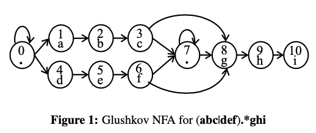
</figure>

### Linear Regex

Regexes composed of concatenated components without alternation are called **Linear Regexes**. They can be composed with the following production rules:
1. regex -> left <b>str</b> <b>FA</b>
2. left -> left <b>str</b> <b>FA</b> | <b>FA</b>

To reliably find string literals, the compiler uses the following guidelines:
1. Find the string that would divide the graph into two subgraphs, with the start state in one and the set of accept states in the other. Matching such a string becomes necessary for a successful match.
2. Avoid short strings; these are prone to matching frequently.
3. Expand small character-sets to multiple strings to facilitate decomposition.
4. Avoid having too many strings; the matcher will become overloaded.

### Graph-based Extraction

It then performs graph-based decomposition to further break the resulting NFA graph into sub-NFA and string literal components. They do this with **Dominant Path Analysis**, **Dominant Region Analysis**, and **Network Flow Analysis**.

<figure>
    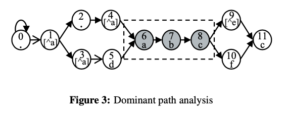
</figure>

Dominant Path Analysis finds the longest common string that exists in all dominant paths of any accept state. For example, in the figure above, the string "abc" must be traversed to get to the accept state 11. Dominant Path Analysis finds the dominant path per accept state and finds the longest common prefix of all dominant paths.

<figure>
    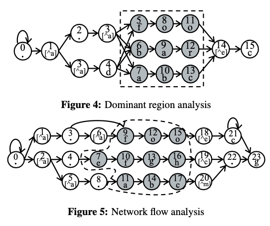
</figure>

If Dominant Path Analysis fails to extract a string, the authors use Dominant Region Analysis. This finds a region of vertices that partition the start state into one graph and all accept states into another. If a discovered region consists of only string or small character-set vertices, this region is transformed into a set of strings. Figure 4 above shows that all paths to the accept state 15 must contain at least one of the following strings: {"foo", "bar", "abc"}.

If neither of the previous analyses are successful, the authors use Network Flow Analysis. For each edge, the analysis finds a set of strings that ends at the edge. The edge is then assigned a score inversely proportional to the length of the strings ending there. With each edge now assigned a score, Network Flow Analysis performs a 'max-flow min-cut' algorithm to find a minimum cut-set that splits the graph into two that separate the start state from all accept states. The 'max-flow min-cut' algorithm then discovers a cut-set of edges that generates the longest strings. Figure 5 above shows that after analysis, "foo", "efgh" and "abc" are extracted as strings from the graph.

The authors find that the majority (87% - 94%) of rules are decomposable.

### Complications

Subregexes with repetition operations (?, *, +, {m,n}) are treated as separate FAs.

## Multi-string Pattern Matching Overview

The purpose of the multi-string matcher, that the authors call **FDR** (after the 32nd president), is to find candidate input strings in the input stream as fast as possible and ignore innocent traffic that would not match any regex patterns.

The existing **Shift-Or** algorithm finds all occurrences of a string pattern in an input stream by performing **bit-wise shift** and **OR** operations. It does this with two key data structures:
1. A shift-or mask (sh-mask('c')) for each character in the symbol set
2. A state mask (st-mask) to preserve the state of matching.

sh-mask('c') zeros all bits whose bit position corresponds to the byte position of 'c' in the string pattern to be matched, while all other bits are 1. The bit position in a sh-mask is counted from the right-most bit, while byte position in a pattern is counted from the left-most byte (This mis-alignment is a problem for SIMD).

For example, for the pattern "aphp", sh-mask('p') = 11110101 because 'p' appears at the second and fourth position in that string pattern. If a character is not used in a  pattern, all bits are 1.

The algorithm updates the st-mask for each input character by performing:

    st-mask = ((st-mask << 1) | sh-mask('c')) for character 'c'

For each matching input character, 0 is propogated to the left by one bit; if the zero bit position reaches the length of the pattern, there is a string match.

<figure>
    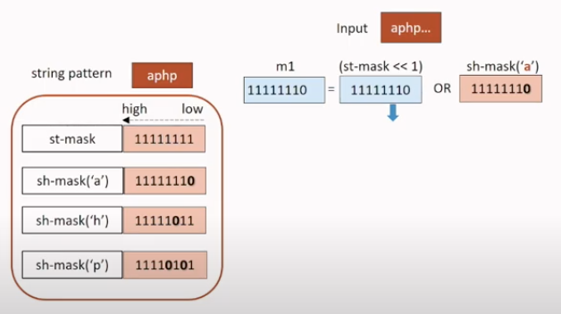
</figure>

This process is repeated, and at the end if there is a 0 bit, there is a match:

<figure>
    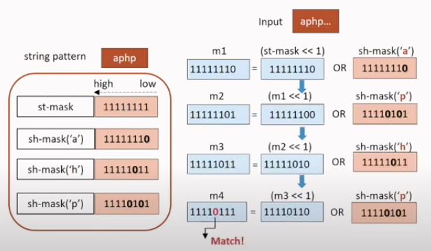
</figure>

The algorithm above is limited in that it can only match one string pattern at a time; it also cannot benefit from SIMD instructions, because of the mis-alignment of the bit-vectors. 

The authors extend this algorithm to multiple patterns by doing approximate matching. First, patterns are grouped into N distinct buckets, with bucket ids from 0 to N-1. The shift masks are then extended by N times, where each upper bit represents a bucket id, rather than a string. The lower bits represents the characters for each of strings inside the bucket. The bit-vectors are also all counted from the right-most byte, allowing for SIMD execution:

<figure>
    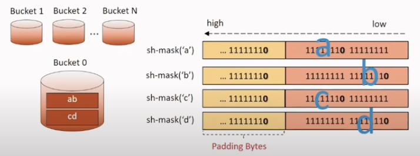
</figure>

In the example below, the author used a shift-mask of 128 bits, and 8 different buckets to represent the different sets of strings. During the matching process, the shift-masks are all shifted, instead of the st-mask, by a multiple of 8 bits, and then an OR operation is computed to get the resulting mask that indicates what bucket and pattern inside the bucket is likely matched.

<figure>
    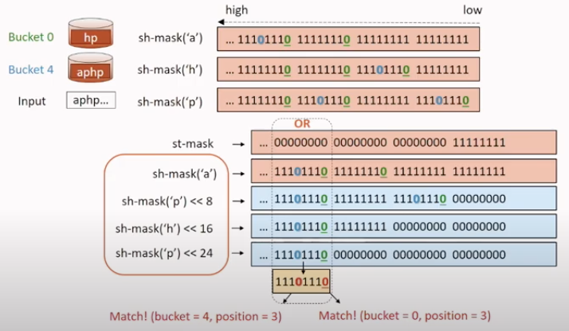
</figure>

The pre-shifting of the shift masks breaks data dependencies, allowing for SIMD instructions.

<figure>
    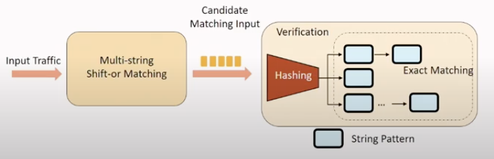
</figure>

The algorithm is shown below:

<figure>
    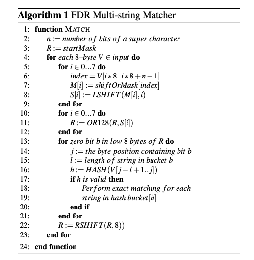
</figure>

## Bit-based NFA Matching

Successful string matching will trigger FA component matching. Hyperscan attempts to use DFAs as much as possible but in some cases it is not possible. Classic NFAs are slow, because of the O(m), where m is the active set size, memory lookups per input character.

Hyperscan introduces a **bit-based NFA engine** that represents each state with one bit in a state bit vector. It then exploits parallel SIMD bit operations to compute the next set of state bits. Each state is assigned an id from 0 to n-1 in topological order. The engine keeps track of a **current-set mask** bitvector that represents all active states with a 1. At time=0, only starting state bits are 1.

The authors define a **span of a state transition** as the id difference between the two states of the transition. Since state ids are sequentually assigned in a topological order, the span of a state transition is typically a small number. The authors exploit this to concisely represent transitions.

The engine implements a state transition with an input character in three steps:

1. Calculate the set of reachable states that can be transitioned to from all active states in the current-set mask. This is effectively the OR of all neighbor states for all currently active states.
2. Compute the set of states that can be transitioned to from any state in the automaton given the current input symbol.
3. Compute the intersection of the two sets. This produces the **successor active set**.

The challenge is efficiently calculating this successor active set. One approach would be to calculate the successor set for every combination of current states, and look up the successor set for the current-set mask. This would be fast, but would require storing 2n successor sets. An alternative approach is to keep a successor-set mask per individual state, and to combine the successor set of every state in the current set. This is more space efficient, but would still require n memory lookups and n-1 OR operations.

The authors use the latter approach but optimize it by minimizing the number of successor-set masks. They do this by keeping a set of shift-k masks shared by all states. A shift-k mask records all states with a forward transition of span k, where the forward transition moves from a smaller state id to a larger one, and a backward transition does the opposite. For the example below, the shift-1 mask sets every bit to 1 except for bit 7, since all states except state 7 have a forward transition of span 1.

<figure>
    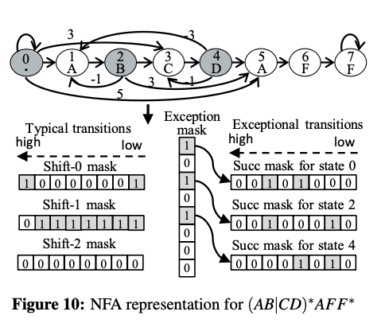
</figure>

State transitions are divided into two types: **typical** or **exceptional**. A **typical** transition is one whose span is smaller or equal to a pre-defined shift limit. Given that shift limit k, the authors build shift-k masks for every k at initialization. These masks allow the authors to efficiently compute the successor set from the current set. If the current-set mask is S, then ((S & shift-k mask) << k) represents all possible successor states with transitions of span k from S. The authors then combine successor sets for all k, obtaining the successor set reachable by all typical transitions.

All other transitions are called **exceptional**. These include forward transitions whose span exceeds k, and any backward transitions. Any state that has at least one exceptional transition keeps its own successor mask. This successor mask records all states reached by exceptional transitions of that state.

The shift limit affects performance; too large, and there are too many shift-k masks, and if too small, there may be too many exceptional states with dedicated exceptional masks. The authors set k to 7 based on their performance analysis. For the figure above, the authors set the shift limit to 2, and mask exceptional edges with the difference of ids. States 0, 2, and 4 are exceptional because they have exceptional outgoing edges.

The algorithm below shows how the bit-based NFA matching works. It combines the successor masks possibly reached by typical transitions (SUCC_TYP) and exceptional transitions (SUCC_EX). It then fetches the reachable state set with the current input symbol (reach[c]), and performs a bitwise AND operation with the combined successor mask (SUCC). The result is the final successor set, and if any accept states become active, there is a match reported. For each input symbol, the engine runes in O(l + e), where l is the shift limit, and e is the number of exception states.

<figure>
    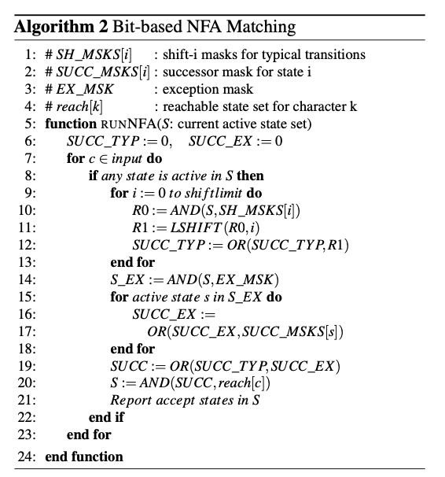
</figure>

# Evaluation

With Snort's ET-Open and with a small set of rules (1k), Hyperscan can get up to a 3.2x speedup over the state of the art approach with random workloads, and up to 2.5x speedup over real web traces.

In terms of single-regex matching, Hyperscan can achieve a 1.8x speedup and 6.9x for multiple-regex matching.

# Citation:

    https://www.youtube.com/watch?v=Le67mP-jIa8&ab_channel=USENIX
    https://www.usenix.org/system/files/nsdi19-wang-xiang.pdf