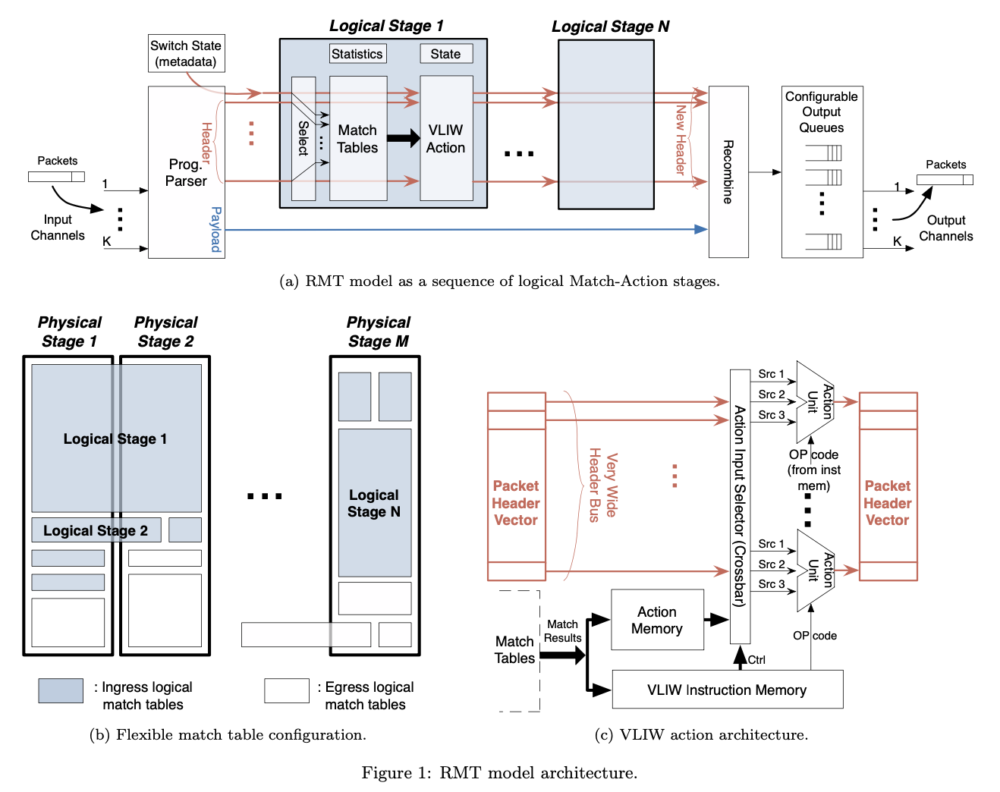

# Forwarding Metamorphosis: Fast Programmable Match-Action Processing in Hardware for SDN

By Pat Bosshart†, Glen Gibb‡, Hun-Seok Kim†, George Varghese§, Nick McKeown‡, Martin Izzard†, Fernando Mujica†, Mark Horowitz‡

†Texas Instruments

‡Stanford University

§Microsoft Research

## Concepts and Definitions

**Software Defined Networks (SDN)**: a means of abstracting network functions into control and forwarding planes for scalability and to add software-controllable functionality.

## Introductions

Abstractions are very important to efficient computing. TCP provides the abstraction of connected queues and IP provides endpoint datagram abstractions. However, routing and forwarding is a mix of routing protocols including: BGP, ICMP, MPLS and forwarding with routers, bridges and firewalls.

Software-Defined Networks (SDNs) are meant to abstract network functions into control and forwarding planes, and control software programs the forwarding plane (switches, routers), using an open interface like OpenFlow. SDNs allow network admins to add new functionalty to their networks and with OpenFlow "Match-Action" can be used to assign actions to packet bytes that match against patterns in a table.

Network speeds, now near 1Tb/sec, require dedicated parallel hardware to do Match-Action. There is a tradeoff between programmability and throughput. Current hardware solutions require replacing hardware for new features.

This work proposes to solve two limitations in switching chips and the OpenFlow protocol:
1. Current hardware switches are rigid, allowing 'match-action' processing on only fixed fields.
2. The OpenFlow specification only defines a limited set of packet processing actions.

The others propose the Reconfigurable Match Tables (RMT) model, a RISC-inspired pipeline architecture for switching chips. RMT allows the forwarding plane to be changed in the field without hardware modification. The programmer can specify multiple match tables of arbitrary width and depth, within resource limits. RMT allows programmers to modify all header fields. Their describes a 64 port by 10 Gb/s switch chip implementing the RT model.

## Single Math and Multiple Match Table Models

In the Single Match Table (SMT) model, the controller tells a switch to match on any set of packet headers from a single match table. The match is an exact match.

In the Multiple Match Tables (MMT) model, multiple smaller match tables are matched by a subset of packet fields. These tables are arranged in a pipeline of stages. The OpenFlow spec transitioned to MMT, and allows users to add new match fields via user-defined fields. 

 

### Hardware Limitations

Existing switch chips implements 4-8 tables, whose widths, depths, and execution order are set when the chip is manufactured. This severely limits the flexibility of these chips. A chip used in a core router may require a 32-bit IP longest-matching table and a small 128-bit ACL match table. An L2 bridge may use a chip with 48-bit destination MAC address match table and a 48-bit source MAC address table. An enterprise router may have a smaller 32-bit IP prefix table and a larger ACL table as well as MAC address match tables. Fabricating separate chips for each use case is inefficient, and so some switch chips are designed to support the superset of these common configurations. These configurable chips still have fixed size tables and pre-determined pipeline ordering, limiting the optimization a user can perform for their network.

These switch chips also offer a limited list of actions that correspond to common processing behaviors: forwarding, dropping, decrementing, TTLs, pushing headers, and GRE encapsulation; OpenFlow only supports a subset of these functions.

## The RMT Architecture

The Reconfigurable Match Table (RMT), presented by the authors, is a refinement of the MMT model. Like MMT, RMT allows a set of pipeline stages each with a match table of arbitrary depth and width (within limits). In addition to this, RMT also allows the data plane to be reconfigured in these ways:
1. Field definitions can be altered and new fields added
2. The number, topology, swidth and depths of match tables can be specified (within resource limits)
3. New actions may be defined, such as writing new congestino fields.
4. Arbitrary modified packets can be placed in specified queues for output on user-defined ports.

With the recent introduction of new protocols like PBB, VxLAN, NVGRE, STT, and OTV, each with new header fields, there is a need for a reconfigurable switch architecture like RMT.

RMT is compatible with the current OpenFlow specification. It does not provide arbitrary payload processing at terabit speeds, but instead it provides the essential minimal set of primitives to process headers in hardware.

<figure>
    
</figure>

### The RMT Parser

The RMT switch consists of a parser that enables matching on fields allowed by an arbitrary number of match stages. The output of the parser is a packet header vector, a set of header fields (such as IP dest, Ethernet dest, etc). In addition the packet header vector includes metadata fields including the input port number on which the packet arrived, and router state variables.

The output vector flows through a series of **logical match stages** that does a level of packet processing. Each match stage allows the match table size to be configured separately; for IP forwarding, you may want a match table of 256K 32-bit prefixes, and for Ethernet 64K 48-bit addresses. An **input selector** pickes the fields to be matched on, and packet modification is done with wide instructions (VLIW) that can work on multiple headers at once.

There is an action unit for each field **F** in the header vector.

Control flow is done by the next-table-address, from each table match that provides the index of the next table to execute. 

A recombination block is required at the end of the pipeline top push header vector modifications back into the packet. FInally, the packet is placed in the specified queues at specified output ports.

RMT allows new fields to be added by modifying the parser, modifying match memories, adding new actions by modifying stage instructions, and new queues.

 

### An Implementation Architecture at 640 Gb/s

## Credit

    https://dl.acm.org/doi/10.1145/2486001.2486011