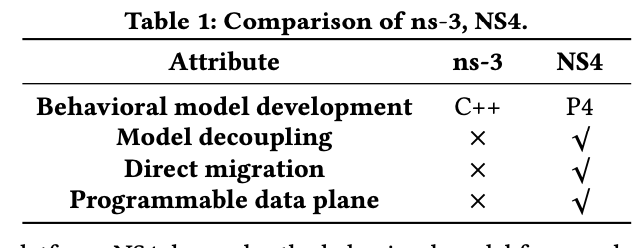
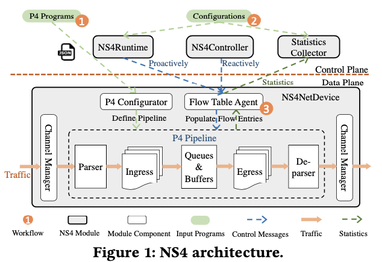
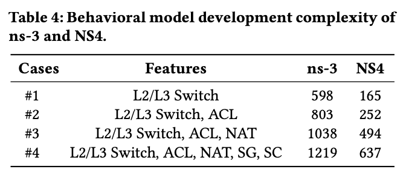
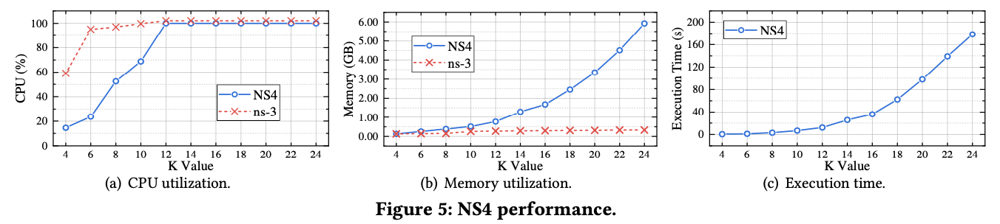

# NS4: Enabling Programmable Data Plane Simulation

    By: Jiasong Bai, Jun Bi, Peng Kuang, Chengze Fan, Yu Zhou, Cheng Zhang
    At: Tsinghua University

## Concepts and Definitions

**P4**: A high-level domain specific language to define the behaviors of programmable network data plane architectures. It defines how switches process packets. A P4-enabled switch can be modeled to function as a parser for extracting header fields, a collection of match-action tables that process these heads, and a de-parser for reconstructing the packets.

**ns-3**: A discrete-event network simulator, where the network system is modeled as events happening in discrete time. A node is the fundamental computing device, an application is an abstraction for a user program that generates activities, and a channel is a subnetwork abstraction.

**fat tree network**: A universal network for provably-efficient communication invented by Charles Leiserson at MIT in 1985. In a fat tree, where the branches represent data links of varied thicknesses (bandwidth), the branches of the tree data structure are "fatter' nearer the top.

## Introduction

P4, a high-level domain specific language (DSL), has attacted attention for its advantages of enabling users to define behaviors of the programmable data plane. Inspired by the idea of DSLs, the authors present NS4, the first P4-driven network simulator supporting simulation of P4-enabled networks. NS4 is integrated with ns-3, a state-of-the-art network simulator, and control plane models to interact with the P4 pipeline.

## Problem: Current Network Simulation

Because it is costly to deploy a testbed network, network simulators are used to validate and evaluate network designs. To conduct a simulation on a network simulator like ns-3, the following steps have to be performed:
1. Develop a behavioral model, implementing network protocols and entities in the simulator
2. Set up the network topology and define tasks
3. Trigger the simulator to test the model.
4. Post-verification, rewrite the simulation code for deployment in testbeds or devices.

These are several **drawbacks** to this approach:
1. Developing the behavioral model is time-consuming and error-prone.
2. Simulation code is tightly-coupled with the simulator and is difficult to port for deployment.
3. Traditional network simulators lack support for programmable data plane like P4

## Solution: NS4

The authors present NS4, a P4-driven network simulator. This simulator supports large-scape P4-enabled networks. They do this by introducing P4 into ns-3, decoupling the behavioral model from the simulation platform. With NS4, P4 users can evaluate on-data-plane application designs such as **distributed protocol acccelerators**, **Layer-4 stateful load balances**, **high-performance monitors**, and **key-value store cache**.

<figure>
    
</figure>

NS4 builds an internal P4 pipeline to process packets as defined by P4 and enables queues and buffers in a pipeline to model the behavior of real P4 devices.

## Design of NS4

<figure>
    
</figure>

The figure above shows the architecture of NS4. NS4 is divided into the **data plane**, which contains a module that models a P4-enabled switch (NS4NetDevice), and a **control plane** composed of modules for controlling the data plane.

To simulate a P4-enabled device, the user instantiates a NS4NetDevice, loads the P4 program, and populates flow entries from the control plane. The authors create internal control plane modules to populate flow entries into the flow tables. This then allows them to collect statistics from the switches. User configurations are loaded and translated into discrete events. The NS4NetDevice is a ns-3 Netdevice.

To simulate a P4 network:
1. Configure the behavior of the data plane by providing P4-compiled programs to the p4 pipeline configurator
2. Create the Control Plane and configure the flow table operations and statistics collection tasks.
3. Build the network topology, install the applications, and trigger the simulation.

### Programmable Data Plane

The NS4NetDevice is a module used for modeling P4 devices; it simulates the behavior of the P4 devices with an internal P4 pipeline. This pipeline, with a P4 compilers like p4c, can support all features of both versions of P4.

### Control Plane of NS4

NS4's control plane has two main purposes:
1. Translate the user configuratinos into discrete events and trigger events
2. Compute routing paths and populate flow entries for packets that don't match the P4 pipeline

## Evaluation

The authors evaluated the effectiveness of NS4 by simulating SilkRoad, a P4 load balanced for data center networks, in a **fat tree network**. They compare the complexity of developing the behavioral models in ns-3 and NS4.

<figure>
    
</figure>

The table above shows the number of lines of C++ code required to simulate the various P4 applications. NS4 consistantly requires less than half of the number of lines of code.

To determine how well NS4 can simulate large-scale networks, the authors simulated fat-tree networks with different k values. They randomly selected communication pairs across all hosts, where the sender sent 1Mbps to the receiver; they then set the simulation duration to 100 seconds. The figure below shows the resulting CPU and memory utilization.

<figure>
    
</figure>

## Conclusion

The authors propose NS4, a discrete-event network simulator that models a network containing one or more P4-enabled devices; they did this by introducing P4 into an existing network simulator, ns-3 for the purpose of simplifying the development of behavioral models as well as simulate the deployable P4 programs.

## Credit

    https://conferences.sigcomm.org/sosr/2018/sosr18-finals/sosr18-final13.pdf
