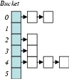
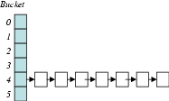

# Denial of Service via Algorithmic Complexity Attacks
USENIX Security '03 paper by Scott A. Crosby and Dan S. Wallach

## Concepts and Definitions

**Ping of Death (PoD)**: a Denial of Service attack whereby a ping command exploits legacy code, crashing the target machine.

**Ping Flood**: a modern version of the PoD attack where a target machine is flooded with unanswered pings.

**Stack Smashing**: a Denial of Service attack whereby the target machine application is forced to overflow its stack.

**Hash Collisions**: when multiple elements hash to the same value, these elements will be inserted into the same bucket, regardless of the number of buckets available.

**Bucket Collisions**: when multiple elements hash to different values, but the modulus of their hashes with the bucket count are the same, these elements will be inserted into the same bucket. This collision type is dependent on the number of buckets available.

**Hash Chain**: a Linked List used to contain all elements that hash to the same Hash Table index.

## Introduction

Algorithm running times are usually analyzed by considering their best-case, common-case, and worst-case runtimes. 

- Unbalanced binary tree insertion is expected to run in average-case **log (log N)** time, but if the inserted elements are sorted, the resulting tree becomes a linked list with **linear (N)** time. 

- Hash table insertion is expected to run in ammortized-case **constant (1)** time, but if the elements hash to the same bucket, the resulting linked-list will run in **linear(N)** time.

Balanced tree algorithms like red-black and AVL trees, as well as universal hash functions avoid these worst-case behaviors, but many applications use simpler functions. If an attacker can control inputs used by these functions, they can induce worst-case performance, and cause a denial-of-service (DoS) attack.

Previous low-bandwidth DoS attacks like **stack smashing** or **ping-of-death** also cause servers to crash with small payloads, but these attacks can be mitigated by implementing them in a safe language. Poorly chosen algorithms cannot be mitigated in this way.

## Attacking Hash Tables

Hash tables are widely used in software applications from compilers for tracking symbol tables, to operating systems for IP fragement reassembly and filesystem lookups. Programmers use hash tables for their common-case constant-time **O(1)** lookups, but the worst-case runtime for these lookups can be **O(N)**!

<figure>
    
        <figcaption>Fig.1 - Common-case with linked-list for collisions.</figcaption>
    
    <figcaption>Fig.2 - Worst-case where all elements hash to the same entry</figcaption>
</figure>

To attack Hash Tables:
1. The hash function needs to be deterministic and known to the attacker.
2. The attacker needs to predict or be able to supply input to the hash table.
3. The attacker needs to be able to provide sufficient input to cause a performance hit.

## Constructing an Attack

1. Analyze a program's vulnerabilities by determining where hash tables are used and if untrusted data is directly fed to the hash tables.

2. Being able to guess the bucket count of the hash tables makes the attack easier, because then only **mod(Hash(k),n)** need to collide; we call these Bucket Collisions. If this is not known, the hashes **Hash(k)** need to collide for all entries; we call these Hash Collisions.

3. Compute attack streams that cause either Bucket or Hash collisions

## Deriving Hash Collisions

Typical programs don't use cryptographically-strong functions like SHA-1, and tend to opt for simpler functions for performance. Also, because the hashing functions tend to work on relatively small input size (32-bits), collisions can be combined by concatenating them in any order, resulting in exponentially many inputs with collisions.

Also, because some hash table implementations use simple hash functions like 32-bit-wide XOR, calculating collisions can often be directly computed from the hash function.

## Application Hash Table Limits

Many applications limit the size that hash tables can grow; if the hash tables aren't allowed to grow enough, the attack will fail. This the case with Linux IP fragment reassembly and Apache Web Server's limits. Also, limiting the input space that the attacker can use for collisions, like limiting the source IP Address, serves to reduce the growth of the hash table.

## Application Analysis: Squid, DJBDNS, Perl

### Squid

Squid is a web proxy cache that caches frequently used objects to reduce network bandwidth. It uses a hash table to track objects cached in memory. The hash table is keyed with a counter, HTTP request method (GET, PUT), and URL, where the counter field can be disabled with a special packet. The authors were only able to increase proxy resolution latency by 1.7ms, but this attacks served as a proof of concept for algorithmic complexity attacks.
  

### djbdns

djbdns is a DNS server implementation created by Daniel Bernstein in response to a security-prone BIND DNS. djbdns prevents a hash flooding attack on the DNS cache by preventing chains from growing beyond 100 entries, treating any additional entries as cache misses.
  

### Perl

Perl provides hash tables called Associative Arrays with 32-bit state machines for computing hashes. These state machines read the input one byte at a time and compute a hash function. The authors were able to find 46 unique collision generators for Perl 5.6.1 and 48 for Perl 5.8.0, providing 97k and 110k 24-bit colliding inputs, respectively.

The authors loaded the colliding strings into the Perl hash tables and achieved the following results:

 

<TABLE>
<CAPTION><STRONG>Table 1:</STRONG>
CPU time inserting 90k short attack strings into two versions of Perl.</CAPTION>
<TR><TD>

<TABLE CELLPADDING=3 BORDER="1" ALIGN="CENTER">
<TR><TD ALIGN="LEFT">&nbsp;</TD>
<TD ALIGN="RIGHT">Perl 5.6.1</TD>
<TD ALIGN="RIGHT">Perl 5.8.0</TD>
</TR>
<TR><TD ALIGN="LEFT">File version</TD>
<TD ALIGN="RIGHT">program</TD>
<TD ALIGN="RIGHT">program</TD>
</TR>
<TR><TD ALIGN="LEFT">Perl 5.6.1</TD>
<TD ALIGN="RIGHT">6506 seconds</TD>
<TD ALIGN="RIGHT"><2 seconds</TD>
</TR>
<TR><TD ALIGN="LEFT">Perl 5.8.0</TD>
<TD ALIGN="RIGHT"><2 seconds</TD>
<TD ALIGN="RIGHT">6838 seconds</TD>
</TR>
</TABLE>

</TD></TR>
</TABLE>

 

The results show that if the Perl interpreter is fed the input designed to collide with that version's hash table implementation, the resulting script slows down by 3 orders of magnitude; from 2 seconds to 2 hours! With 1 hour of computing collision inputs, the authors could cause an increase in runtime of their script of 2 hours.
  

### Bro

Bro is an open source Network Intrusion Detection System (NIDS). It scans network packets at runtime and correlates events to detect attacks. It uses hash tables that use a hash function that XORs inputs together. This makes deriving collisions easy. 

Bro includes a port scanning detector that uses a hash table to track (source IP address, destination port) tuples. The hash function is computed by XORing the source IP address in network byte order with the destination port number, in host order. The authors found that by flipping bits in the first two octets of the UP address with the matching bits in the port number, they could find collisions.

 

<TABLE>
<CAPTION><STRONG>Table 2:</STRONG>
Total CPU time and CPU time spent in hash table code during an offline processing run of 64k attack and 64k random SYN packets.</CAPTION>
<TR><TD>

<TABLE CELLPADDING=3 BORDER="1">
<TR><TD ALIGN="LEFT">&nbsp;</TD>
<TD ALIGN="RIGHT">Attack</TD>
<TD ALIGN="RIGHT">Random</TD>
</TR>
<TR><TD ALIGN="LEFT">Total CPU time</TD>
<TD ALIGN="RIGHT">44.50 min</TD>
<TD ALIGN="RIGHT">.86 min</TD>
</TR>
<TR><TD ALIGN="LEFT">Hash table time</TD>
<TD ALIGN="RIGHT">43.78 min</TD>
<TD ALIGN="RIGHT">.02 min</TD>
</TR>
</TABLE>

</TD></TR>
</TABLE>

  

## Solving Algorithmic Complexity Attacks

Security through obscurity is never the solution, and it is necessary to either not allow for predictable worst-case inputs, or have a means of detecting worst-case behavior and taking actions to correct them.

1. As an example, instead of using unbalanced binary trees, red-black and splay trees have guaranteed worst-case bounds.

2. To make it harder for an attacker, use cryptographically strong hash functions like SHA-1 that are resistant to computing large numbers of second pre-images of the hash function.

3. Also replacing deterministic hash functions with probability hash functions, or using universal hash functions can solve the problem of reducing collisions.

## Conclusions

The authors present **algorithmic complexity attacks**, a class of low-bandwidth denial of service attacks. These attacks don't exploit bugs, but rather the worst-case performance of algorithms chosen by developers. The authors analyzed several applications and demonstrated significant slowdowns in applications with relatively small bandwidth and payloads.

The authors note that many applications choose algorithms based on common-case behavior, not expecting worst-case scenarios to occur during deployment. This work demonstrates that attacks can leverage these assumptions, and that future design choices should consider algorithmic complexity attacks.

## Links and Follow-On Work

Algorithmic DoS attacks are similar to other low-bandwidth DoS attacks like:

- Stack Smashing

- ping-of-death

- Nested HTML tables that cost the browser super-linear work to resolve layout

- SSL attacks where clients coerce the server to perform RSA decryptions

## Credit

    https://www.usenix.org/legacy/events/sec03/tech/full_papers/crosby/crosby_html/