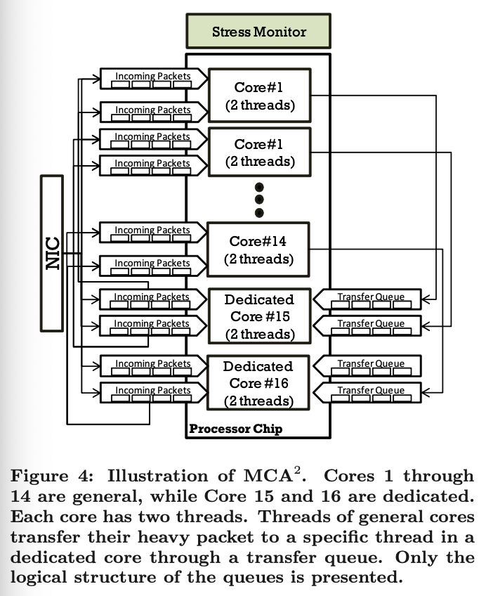
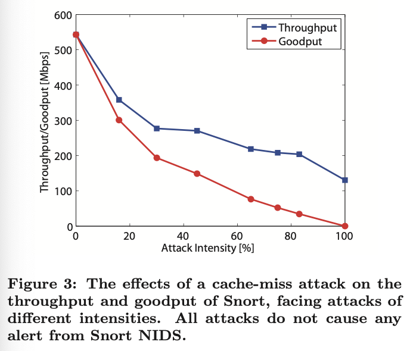
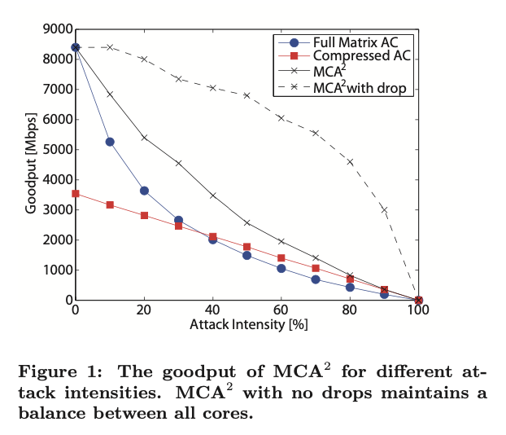

# MCA2: Multi-Core Architecture for Mitigating Complexity Attacks

Paper by Yehuda Afek§, Anat Bremler-Barr†, Yotam Harchol‡, David Hay‡, Yaron Koral§

§ Tel Aviv University

† The Interdisciplinary Center

‡ The Hebrew University

 

## Concepts and Definitions

**Complexity Attack**: when an attacker exploits the system's worst-case performance, which differs significantly from the average case.

**Heavy Messages**: messages that consume a substantial amount of system resources.

**Cache-Miss Attack**: when an attacker sends heavy messages that cause the target application to deviate from the expected memory access pattern, resulting in a high cache miss rate.

**Deep Packet Inspection (DPI)**: process whereby message payloads are inspected for malicious activities

**Goodput**: the main performance metric of this work; it is the volume of non-malicious packets that are processed.

 

## Introduction

**Network Intrusion Detection and Prevention Systems (NIDS/NIPS)** are the front line defense against cyber attacks on a network; **Snort** and **Bro** are two open-source NIDS/NIPS implementations. 

Recently, two-phase **combined attacks** are used to attack a network:
1. the attackers neutralize the NIDS/NIPS peripheral with a DoS attack
2. the attackers attack the assets on the network

A DoS attack on NIDS and NIPS have different outcomes. For an attack on NIDS, the monitoring peripheral may be unable to inspect part, or all of the attack traffic, allowing for an attack to pass unnoticed. The NIPS may be forced to drop traffic, causing a DoS on the services provided by the network it is protecting.

**Complexity Attacks (CA)** are used in the first phase; to neutralize the NIDS/NIPS peripherals. They exploit the worst-case peformance of the algorithms used by these programs by attacking the algorithms with **heavy messages** that elicit worst-case algorithmic behavior.

This work introduces Multi-Core Archiecture for Mitigating Complexity Attacks (MCA2), a general framework for mitigating network-based complexity attacks by leverages multi-core architectures. MCA2 uses CPU cores to identify these heavy messages and divert them to a fraction of the system cores dedicated to heavy messages; this keeps the remaining cores unaffected.

The authors evaluate their framework against cache-miss complexity attacks against Deep Packet Inspection (DPI) engines. For the Snort DPI engine, an attack with 30% malicious packets decreases system throughput by 50%, while MCA2 throughput drops by only 20%.

 

## MCA2

MCA2 operates with a multi-core system, where each core runs one or more threads. Each thread receives references to packets for inspection via queues. The system works in **routine-mode**, where all threads operate the same, or **alert-mode**, where dedicated threads handle heavy packets. The system's **stress monitor** switches between modes depending on the percentage of heavy packets.

<figure>
    
</figure>

MCA2 can mitigate complexity attacks with the following properties:

1. Heavy packets consume considerably more resources than normal packets.

2. Heavy packets can be identified for low resource cost.

3. Packets can be moved between CPU cores.

4. There is a method to handle heavy packets more efficiently than the method for normal packets

It does this by scanning the first few bytes of incoming packets and determining if the packet is heavy or normal.

 

## Deep Packet Inspection

**Deep Packet Inspection (DPI)** is the process of inspecting a message's payload for malicious activities. DPIs usually use two classes of pattern matching:
1. Exact Matching: Usually uses a DFA
2. Regular Expression Matching: Usually uses a DFA or NFA

Given a DFA generated from a set of patterns, a packet is inspected by traversing the automaton byte by byte. These AC DFAs are very large; for Snort's 31,094 patterns, the DFA has 77,182 states.

Snort uses a full-matrix encoding for its AC DFA; transitions are stored in a two-dimensional array. One dimension indexes the active state, and the 2nd the input alphabet; the resulting lookup resolves the next state. This table can be very large; the author's implementation had a memory footprint of 75MB. The advantage of this approach is that a transition costs one memory load operation.

 

## Example AC Attacks

 

### Cache-Miss Attack on Snort's Signature Detection Engine

Snort's Signature Detection Engine uses a variant of the Aho-Corasick (AC) algorithm for pattern matching. AC uses a large DFA that cannot entirely fit into the cache, but because most normal traffic only uses a small subset of the automaton states, a large fraction of DPI memory accesses result in a cache hit.

An attacker can craft **heavy packets** that cause an exhaustive traversal over the DFA, resulting in cache pollution. Heavy traffic will result in cache misses, which will slow down the application, and the resulting polluted cache will slow down normal traffic. This type of attack is called a **Cache-Miss Attack**.

The authors demonstrate this attack in two steps:
1. Collect the publically-available signature set. To prevent the attack from being detected, they omit the last character from each pattern.

2. Construct a set of HTTP traffic traces that mix attack packets with normal HTTP traffic with different attack intensity levels (0% to 100%).

<figure>
    
</figure>

The figure above shows how the total throughput, and the goodput change as a function of the attack intensity. The total throughput of Snort drops by a factor of 1.5 for an attack intensity of 16%. This result shows that the exact string matching engine is a bottleneck in Snort. Snort breaks each regular expression into several exact patterns and invokes a regular expression engine upon matching the exact patterns.

MCA2 detects these **heavy packets** in two steps:
1. Training data is used to mark common states of the DFA; these are the states frequently visited by processing normal packets.

2. For each packet, count the fraction of non-common states visited; as soon as the fraction exceeds a threshold, the packet is marked **heavy** and offload to the heavy core.

If MCA2 is configured to not drop packets, it uses the Full Matrix AC implementation for normal traffic, and Compressed AC on the heavy cores.

<figure>
    
</figure>

The figure above shows the performance of representing the full DFA (Full Matrix AC), compressing the DFA (Compressed AC), and MCA2 with and without dropping packets. MCA shows a considerable speedup with any attack intensity over 0%.

 

### Active States Explosion Attack on Hybrid-FA Regex Engine

Because of the **state blow-up** phenomenon, regular expressions are usually not represented with DFAs. The DFA is typically replaced with an NFA, where the matching algorithm keeps track of a vector of active states, and for each input, computes the next set of active states; this can be significantly less efficient on a CPU.

Becchi et al. proposed a hybrid approach called Hybrid-FA where the NFA is partially determinized. The **head DFA** represents commonly-traversed states in the automata, border states are non-deterministic and are linked to **tail DFA** states.

Hybrid-FA uses a single "head-DFA" for common states, and the other parts of the automaton are kept as separate DFAs, activated when required. A Complexity Attack causes the Hybrid-FA to active many states in parallel, degrading system performance.

 

## Credit

    https://ieeexplore.ieee.org/document/7846702