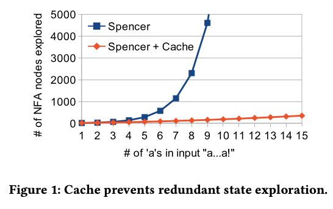

# Rethinking Regex Engines to Address ReDoS

By James Davis at Virginia Tech

 

## Concepts and Definitions

**Spencer's Regex Algorithm**: is used by most programming languages and relies on backtracking-based NFA simulation.

**Regular Expression Denial of Service (ReDoS) Attack**: when an attacker exploits super-linear regex behavior in software to divert resources away from legitimate code

 

## Introductions

Regular Expression libraries in Python, Java, and Javascript have worst-case exponential-time matching runtime. This exposes software that uses these libraries to Regular Expression Denial of Service (REDoS) attacks.
The authors find that 95% of regexes in popular programming languages can be evaluated in linear time. The authors propose a redsign of regex engines, trading space for time, to augment existing regex engines to be safer.

 

## Spencer's Regex Algorithm

Henry Spencer's regular-expression matcher serves as the backtracking-based NFA simulation engine used by many modern languages. The worst-case time complexity caused by the catastrophic backtracking exposes the application to a denial of service attack vector.

High-complexity regex matches depend on three conditions:
1. the engine's algorithm
2. the regex's NFA has high ambiguity
3. the regex's input exploits the ambiguity

If an attacker leverages this super-linear match behavior, it is called a Regular Expression Denial of Service (ReDoS) attack where the goal is to divert resources from legitimate work.

 

## Programming Language Discoveries

The authors investigate a dataset of 537,806 regexes written in 8 different languages. They found that super-linear regex complexity is common, with 38.4% of Python regexes exhibiting this trait.

Most regex engines support features beyond automata-theoretic regular expressions. Backreferences and lookaround assertions also result in the super-linear complexity.

 

## Regex Engine Design

The authors propose inserting a state cache into existing Spencer-based regex engines. This cache caches the states that the simulation has visited in the NFA during a traversal, preventing multiple loads of the states that have already been visited. Adding the cache offers the same worst-case linear-time complexity as Thompson's algorithm, but with a larger space complexity than the Spencer-based engine. Also, it does not change the match/mismatch behavior of the engine, allowing for easier integration with existing engines.

<figure>
    
</figure>

After prototyping the cache, the achieved the performance shown above.

 

## Credit

    The original short paper:

        https://dl.acm.org/doi/abs/10.1145/3338906.3342509?