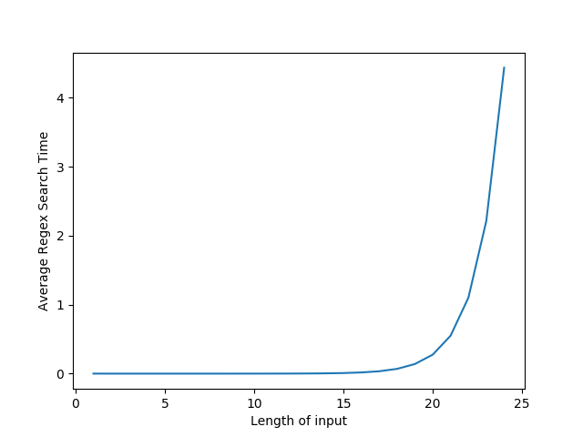

# Regular expression Denial of Service - ReDoS
    Presented by Alex Roichman and Adar Weidman of Checkmarx
## Concepts and Definitions

- **Regular expression Denial of Service (ReDoS)**: A Denial of Service attack that exploits vulnerabilities in Regular Expression engines. It works by providing the engine a regex or input that causes the engine to significantly slow down.

- **Evil Regex**: A Regular Expression is called evil if it can be stuck on a crafted input. This crafted input usually contain groupings with repetitions, and does not match the regex.

- **Backreferences**: A Backreference is a reference to a previously-matched text, as matched by a capture group. An example, would be a regular expression that wants to find matching opening and closing HTML tags.

        <([A-Z][A-Z0-9]*)\b[^>]*>.*?</\1>

        The first capture group is: ([A-Z][A-Z0-9]*)
        \1 then references the text matched by the capture group

<br>

## Introduction

A Regular Expression can be converted into a Nondeterministic Finite Automaton (NFA), where the Regular Expression engine starts at a start state and makes transitions until the end of the input. The problem with an NFA, is that there can be multiple next states. In this case the algorithm may try all possible paths through the NFA until a match is found, or try all paths and fail. This last case can result in a runtime that is exponential in the input size. Most engines also provide additional functionalities like **backreferences** that cannot be solved efficiently.

Writing robust Regular Expressions is hard, and many programmers aren't aware of regex threats. Testing usually involves checking to see if the Regex matches on the intended input, but doesn't explore the space of non-matching inputs.

<br>

## Example Evil Regexes

Below are several example **Evil Regexes**:

1. <h3><a href="http://regexlib.com/REDetails.aspx?regexp_id=1757">ReGexLib,id=1757 (email validation)</a></h3>

    ```^([a-zA-Z0-9])(([\-.]|[_]+)?([a-zA-Z0-9]+))*(@){1}[a-z0-9]+[.]{1}(([a-z]{2,3})|([a-z]{2,3}[.]{1}[a-z]{2,3}))$```

To demonstrate the eviliness of this regex, we tested the time required to match this Regex to an input composed of a chain of "A"s of varying length in Python with the RE library. The code is <a href="https://github.com/tjt7a/paper_summaries/tree/main/Projects/Snort/Summaries/Projects/Code/test_regex.py">here</a>.

<figure>
    
        <figcaption>Fig.1 - Time it took to match the above evil regex to an input of only As.</figcaption>
</figure>

Our experiment showed that with an input composed of only 24 'A's, the regular expression match took a whole 4 seconds; adding a few additional As would result in a long runtime.

<br>

2. <h3><a href="https://wiki.owasp.org/index.php/OWASP_Validation_Regex_Repository">OWASP Validation Regex Repository (Java Classname)</a></h3>

    ```^(([a-z])+.)+[A-Z]([a-z])+$```

<figure>
    
        <figcaption>Fig.2 - Time it took to match the above evil regex to an input of only As.</figcaption>
</figure>

This regular expression also showed an exponential relationship with the length of the input, taking 7 seconds to match an input composed of 35 'A's.

<br>

3. <h3>Other Examples</h3>

-   Regex: ^\[(,.*)*\]$   

    Payload: [,,,,,,,,,,,,,,,,,,,,

    Source: DataVault

-   Regex: \A([A-Z,a-z]*\s?[0-9]*[A-Z,a-z]*)*\Z

    Payload: aaaaaaaaaaaaaaaaaaaaaaa!

    Source: WinFormsAdvanced


-   Regex: ^([^\"+]+)(?:\\([^\"]+))*$

    Payload: \\\\\\\\\\\\\\\\\\\\\\\\\"

    Source: EntLib

<br>

## To ReDoS a System

There are two methods to ReDoS a system:
1. Craft an input that causes worst-case performance on an existing regex or set of regexes. This is done by crafting a non-matching input that requires a full search of the regex.

2. Inject a regex if the system builds them dynamically. This regex will have many potential paths for the engine to search on a non-matching input. One example of such a regex is: 
    ```
    (.+)+\u001
    ```

<br>

## Crafting Malicious Inputs

In a **Blind Attack**, the Regex is unknown to the attacker. The attacker can attempt to find a regex that would match a selected input and test to see if there is an effect when sending the input. Many applications are open source, and often the regexes are known. In a **Non-Blind Attack**, the input is generated from a weakness in the known Regex.

<br>

### Web Application Attack

To attack a web app:
1. Open the source HTML.
2. Find Javascript regexes.
3. Craft malicious inputs for the regexes and test.
4. Submit valid value and change request to contain malicious input.

<br>

### Crafting Malicious Regexes

Some applications receive a search key in the format of a regex, and others concatenate user inputs to generate a regex. These applications are open to **regex injection**.

<br>

## Probing for ReDoS

If the attack is blind, the attacker can submit multiple invalid escape sequences like "\m". If an error message indicates an invalid escape sequence, then the input was evaluated by a regex, and the attacker can submit:

        (.+)+\u0001

<br>

## Preventing ReDoS

1. Dynamically built, input-based regexes should never be used, or be appropriately sanitized.

2. All regexes should be checked for ReDoS safety before deployment.

<br>

### Regex Validation

There are two main strategies for validating inputs and regexes:
1. Accept known good regexes with anchors, that start with a ^ and end with a $, so the entire input is evaluated, instead of a part of it.

2. Reject bad input; regexes can be used to reject input that triggers bad performance on other regexes.

<br>

### Google CodeSearch

Google's CodeSearch uses regexes in the search engine to locate strings in available source code. A **Meta-Regex** is a regex that is used to find **evil regexes**; examples:

- Regex.+\(\.\*\)\+
- Regex.+\(.\.\*\)\*

<br>

## Links and Follow-On Work


<h3><a href="https://github.com/tjt7a/paper_summaries/blob/main/Projects/Snort/Summaries/Papers/1.%20Denial%20of%20Service%20via%20Algorithmic%20Complexity%20Attacks.md">Denial of Service via Algorithmic Complexity Attacks</a></h3>

<h3><a href="https://github.com/google/codesearch">Google Codesearch</a></h3>

<br>


## Credit

This is a summary of the OWASP:

    https://owasp.org/www-community/attacks/Regular_expression_Denial_of_Service_-_ReDoS

We used the example of a backreference as presented by:

    https://www.regular-expressions.info/backref.html


We referenced the original presentation from here:

    https://www.slideshare.net/source-code-analysis/redos-regular-expression-denial-of-service-attacks